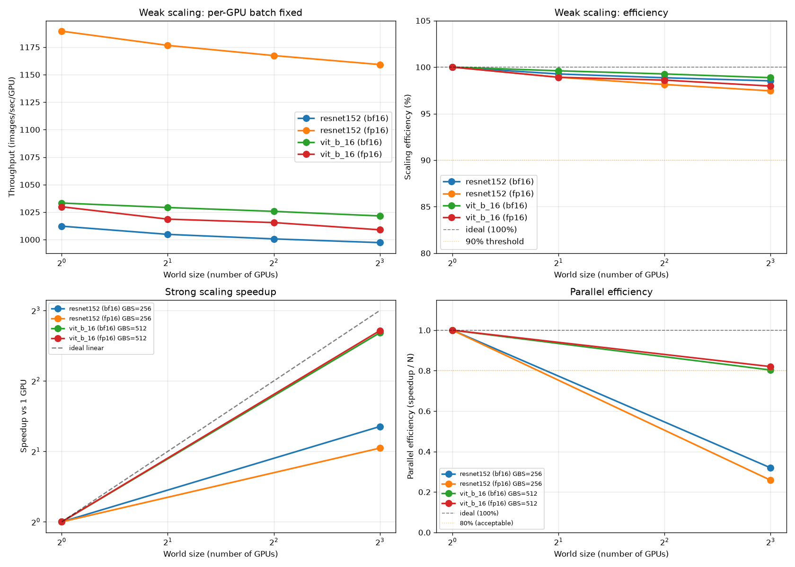
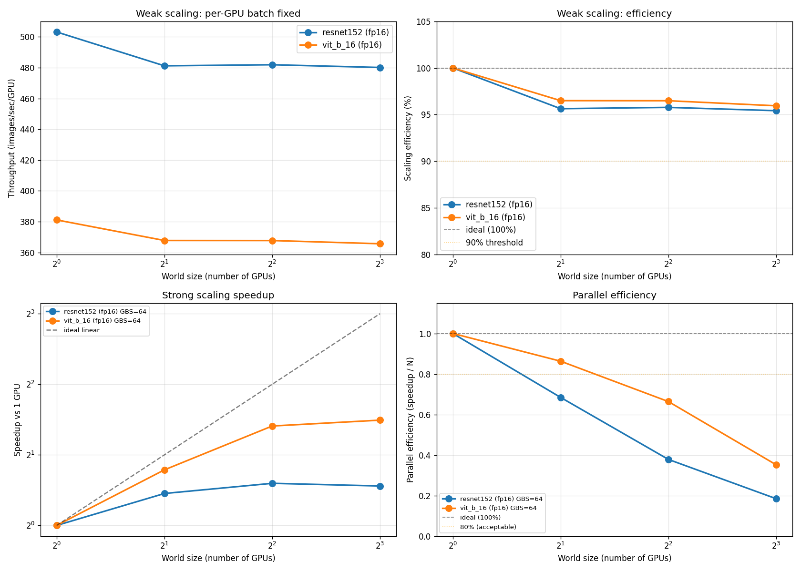

# PyTorch DDP Scaling Benchmark

A reproducible benchmark for measuring PyTorch Distributed Data Parallel (DDP) scaling on NVIDIA GPUs. Reports weak scaling efficiency, strong scaling speedup, parallel efficiency, and GPU activity across single-GPU and single-node multi-GPU configurations.

Uses synthetic on-device data to isolate GPU compute and NCCL communication from data loading. Supports both Slurm cluster environments and direct instance execution (e.g. Lambda Cloud).

## Supported hardware

Tested on NVIDIA A100 SXM4 80GB, B200, and RTX Pro 6000 Blackwell. Should work on any NVIDIA GPU with a recent PyTorch release, including V100 (sm_70), A100 (sm_80), H100/H200 (sm_90), and newer architectures. The code is architecture-agnostic; only the PyTorch and CUDA versions need to match your hardware.

Note: V100 does not support bf16 natively. Use `--precision fp16` on V100.

## Supported models

| Model | Type | Parameters | Notes |
|---|---|---|---|
| `resnet152` | CNN (compute-heavy) | ~60M | Recommended; largest ResNet variant |
| `vit_b_16` | Transformer (communication-heavy) | ~86M | Reveals interconnect sensitivity |
| `resnet50` | CNN | ~25M | Lightweight baseline |
| `resnet101` | CNN | ~45M | Mid-size option |

Using both `resnet152` and `vit_b_16` together shows how model architecture affects DDP scaling behavior: CNNs are compute-bound and scale efficiently; transformers have larger gradient payloads and are more sensitive to interconnect bandwidth.

## Files

- `benchmark_ddp.py` — main benchmark script, launched via torchrun
- `run_1gpu.sbatch`, `run_1node_multigpu.sbatch`, `run_multinode.sbatch` — Slurm job wrappers
- `submit_sweep.sh` — submit a full matrix of Slurm jobs
- `analyze_results.py` — aggregate JSON outputs into a table with speedup and efficiency
- `visualize_results.py` — generate PNG plots from results
- `find_max_bs.py` — find the largest safe per-GPU batch size for your GPU and model
- `PROGRAM_RUNDOWN.md` — full explanation of what the benchmark does and why

## Setup

### Step 1: create a Python environment

```bash
python -m venv venv
source venv/bin/activate

# Install PyTorch matching your CUDA version
# CUDA 13.0 (Blackwell and newer):
pip install torch torchvision --index-url https://download.pytorch.org/whl/cu130

# CUDA 12.6 (Hopper, Ampere, Ada Lovelace):
# pip install torch torchvision --index-url https://download.pytorch.org/whl/cu126
```

### Step 2: verify GPU support

```bash
python -c "import torch; print(torch.cuda.get_arch_list())"
```

Expected compute capabilities:
- V100 → `sm_70`
- A100 → `sm_80`
- H100 / H200 → `sm_90`
- B200 → `sm_100`
- RTX Pro 6000 Blackwell → `sm_120`

### Step 3: find your GPU's max safe batch size

Before running the sweep, use `find_max_bs.py` to determine the largest batch size that fits in your GPU's VRAM:

```bash
python find_max_bs.py --model resnet152 --precision fp16
python find_max_bs.py --model vit_b_16  --precision fp16
```

Use the recommended values to set `PER_GPU_BS` in the sweep scripts. See the table below for measured values on tested hardware.

### Measured batch sizes by GPU

| GPU | VRAM | resnet152 fp16/bf16 | vit_b_16 fp16/bf16 |
|---|---|---|---|
| V100 SXM2 | 16 GB | 128 | 128 |
| A100 SXM4 | 80 GB | 512 | 1024 |

Values are the largest power of 2 that fits within 90% of VRAM. Run `find_max_bs.py` to confirm on your hardware.

## Running on a Slurm cluster

### Step 1: configure the sbatch scripts

Each sbatch script has a module load block at the top:

```bash
module load cuda/13.1   # adjust to your cluster's CUDA module
module load miniforge3  # adjust to your cluster's conda module
# source activate <env>
```

Adjust `cuda/13.1`, the conda module name, and the activation line for your environment. You may also need `--partition`, `--account`, and `--constraint` headers.

### Step 2: configure submit_sweep.sh

Edit the `CONFIG` section at the top of `submit_sweep.sh`:

```bash
declare -A PER_GPU_BS_MAP=(
    ["resnet152"]=512    # from find_max_bs.py
    ["vit_b_16"]=1024
)
declare -A GLOBAL_BS_MAP=(
    ["resnet152"]="256 512"
    ["vit_b_16"]="512 1024"
)
```

### Step 3: run

```bash
./submit_sweep.sh
squeue -u $USER
```

Override defaults at submit time:

```bash
sbatch --export=ALL,SCALING=strong,GLOBAL_BS=512,PRECISION=fp16 run_1gpu.sbatch
```

## Running on a cloud instance (no Slurm)

For single-instance environments such as Lambda Cloud, use `run_bench.sh` and `sweep_*.sh` directly instead of the sbatch scripts:

```bash
# Find safe batch sizes first
python find_max_bs.py --model resnet152 --precision fp16

# Edit sweep script CONFIG section, then run
./sweep_a100.sh    # for A100 instances
./sweep_v100.sh    # for V100 instances
./sweep_h100.sh    # for H100 instances
```

## Scaling modes

**Weak scaling** (`SCALING=weak`): per-GPU batch size is fixed. Global batch grows with world size. Measures: can each GPU stay fully utilized as more GPUs are added? Ideal result: per-GPU throughput stays constant. Falling per-GPU throughput reveals communication overhead.

**Strong scaling** (`SCALING=strong`): global batch size is fixed. Per-GPU batch shrinks as more GPUs are added. Measures: how much faster does the same problem run with more GPUs? Ideal speedup: N× for N GPUs.

## Precision

Both fp16 and bf16 are supported via `--precision` or the `PRECISION` env var.

- fp16: works on V100, A100, H100, and newer
- bf16: hardware-accelerated on A100 and newer only; V100 will silently fall back to fp32 computation, producing slower and misleading results -- do not use bf16 on V100

On A100, fp16 and bf16 have the same VRAM usage (both 2 bytes per value) but different compute paths. Empirically, fp16 is faster than bf16 for ResNet-152 on A100 due to better-optimized cuDNN NHWC convolution kernels. ViT-B/16 shows no meaningful difference between fp16 and bf16 on A100.

## Analyzing results

```bash
python analyze_results.py results/
```

Prints weak scaling efficiency, strong scaling speedup and parallel efficiency, and flags suspicious results (high straggler ratio, high step-time variance, low GPU activity).

## Visualizing results

```bash
pip install matplotlib
python visualize_results.py results/ --device-label "A100 80GB"
```

Generates PNG plots in `plots/`: a 2×2 overview (weak throughput, weak efficiency, strong speedup, parallel efficiency), individual plots for each metric, and a GPU activity bar chart.

## Sample results

### NVIDIA A100 SXM4 80GB (8 GPUs, NVLink 3.0)

Weak scaling (per-GPU batch fixed, fp16):

| Model | Per-GPU BS | 1 GPU img/s | 8 GPU efficiency |
|---|---|---|---|
| ResNet-152 | 512 | 1189.5 | 97.4% |
| ViT-B/16 | 1024 | 1029.9 | 98.0% |

Weak scaling (bf16):

| Model | Per-GPU BS | 1 GPU img/s | 8 GPU efficiency |
|---|---|---|---|
| ResNet-152 | 512 | 1012.2 | 98.5% |
| ViT-B/16 | 1024 | 1033.3 | 98.9% |

Strong scaling at GBS=512 (ViT-B/16, fp16, 1 to 8 GPUs): 6.42x speedup (80.3% parallel efficiency).



### NVIDIA V100 SXM2 16GB (8 GPUs, NVLink 2.0)

Weak scaling (per-GPU batch fixed, fp16):

| Model | Per-GPU BS | 1 GPU img/s | 8 GPU efficiency |
|---|---|---|---|
| ResNet-152 | 128 | 503.2 | 95.4% |
| ViT-B/16 | 128 | 381.2 | 95.9% |

Strong scaling at GBS=64 (ViT-B/16, fp16, 1 to 8 GPUs): 2.81x speedup (35.1% parallel efficiency).



### Generation comparison (fp16, each GPU at its max batch size)

| Model | V100 img/s/GPU | A100 img/s/GPU | A100 / V100 |
|---|---|---|---|
| ResNet-152 | 503 | 1190 | 2.37x |
| ViT-B/16 | 381 | 1030 | 2.70x |

Raw JSON results and plots for both systems are in the `results/` and `plots/` directories.

## Multi-node troubleshooting

If `run_multinode.sbatch` hangs at NCCL init, check `NCCL_DEBUG=INFO` output for the network interface NCCL selected. If it chose the management network, set `NCCL_SOCKET_IFNAME` to your high-speed NIC (`ib0` for InfiniBand, or an interface starting with `enp` for RoCE).

## What this benchmark does not measure

- Data loading throughput (uses synthetic on-device data)
- Model accuracy or convergence (random labels)
- FP8 or Transformer Engine paths
- Optimizer overhead beyond SGD

## License

MIT License. See LICENSE file.

## Citation

If you use this benchmark in academic work, please cite:

```bibtex
@software{paik_pytorch_ddp_benchmark_2026,
  author = {Paik, Ghanghoon},
  title  = {PyTorch DDP Scaling Benchmark},
  url    = {https://github.com/willgpaik/pytorch-ddp-scaling-benchmark},
  year   = {2026}
}
```
